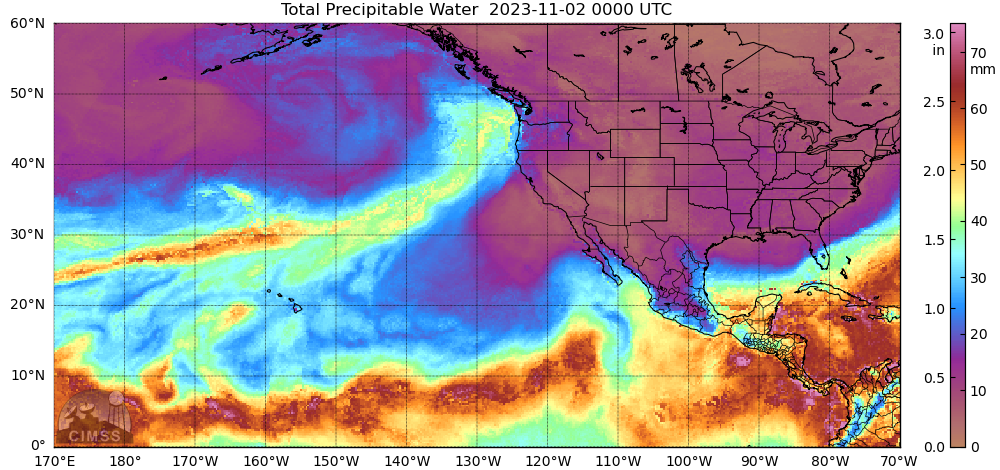

# Watershed Conditions Summary and Climate Outlook

```{admonition} **Last updated on:**
December 1, 2023
```

This webpage provides a series of plots, maps, and images summarizing the current and recent weather conditions in Metro Vancouver's water supply areas. You will also find a detailed medium-to-long range [](outlook.md). This climate outlook will be updated each month during the first week of the month. 

The purpose of this page is to provide resources for source water supply planning, and operational decision-making.  

### Credits

This resource is created by Peter Marshall (Contact: [Peter.Marshall@metrovancouver.org](mailto:Peter.Marshall@metrovancouver.org)). Weather and climate data are primarily from a network of hydro-meteorological stations within the water supply areas. Check out the [](overview_map.ipynb) to see the location of some of these monitoring stations. Additional data and plots from federal and provincial government agencies, research institutes, and US climate services are also included. Check out the [](links.md) section for more information about any of these products, or for the most current conditions. 
